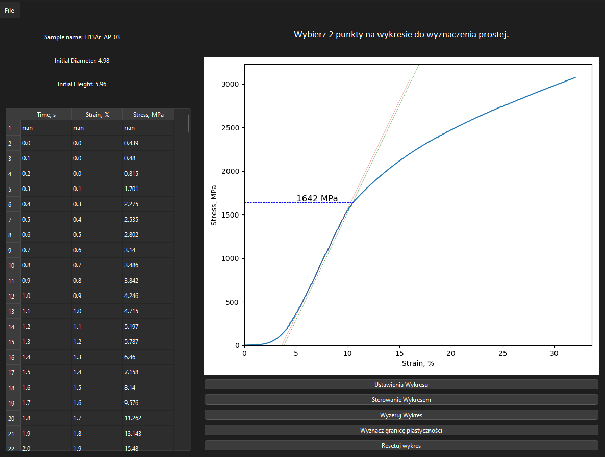

## Overview:
**Compression Test App** is a Python-based desktop application designed to facilitate the visualization and analysis of data from CSV files, specifically focusing on plotting stress-strain curves for materials testing. The application provides various tools for data manipulation, such as adjusting plot settings, controlling axis scales, and estimating material properties like yield strength.

## Features:
- **CSV Data Loading:** Load CSV files containing material testing data with automatic encoding detection.
- **Data Visualization:** Plot data points for analysis and visualization using matplotlib.
- **Interactive Plot Controls:** Customize plots through dialog boxes to set axis ranges, adjust grid visibility, and more.
- **Regression and Yield Strength Estimation:** Calculate and display a regression line and the yield strength of materials based on user-defined points.
- **Data Scaling:** Rescale data to zero to align with specific experimental conditions.
- **Reset and Update Functions:** Reset the plot to its initial state or update it with new data or settings.

## App GUI:

## License:
This project is licensed under the MIT License. See the LICENSE file for more details.